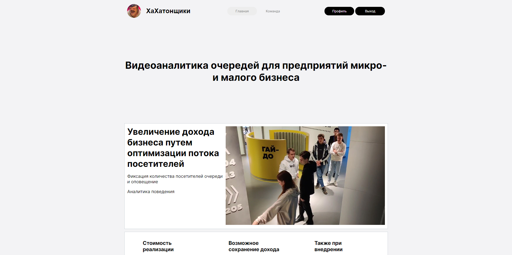
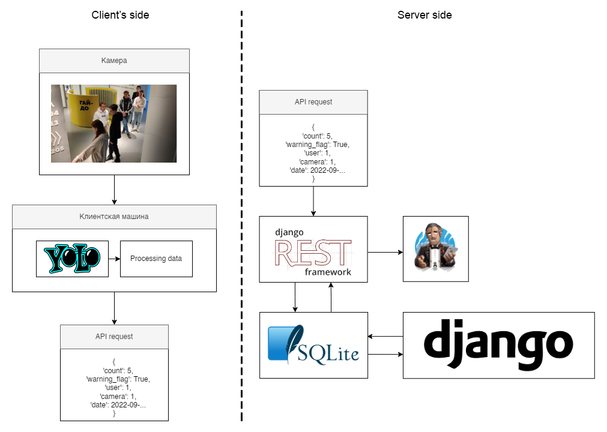
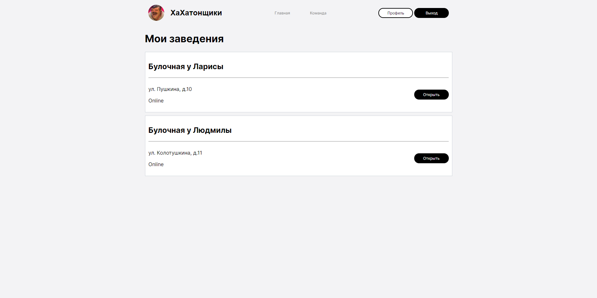
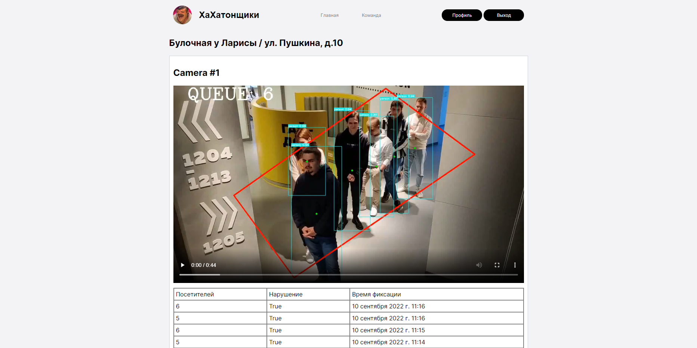

<h1 align="center">Queue video analytics for optimization of small business processes</h1>

<p align="center"></p>

The project was made during a <a href="https://ai.itmo.ru/dataproducthack">Data Product Hack</a>, which was held
offline at ITMO University between 3th and 10th September 2022 as part of an AI-powered video analytics track.

The main purpose of the idea is analyze the number of people standing in a queue, collect data, and notify the personel
when there is a need to call one more cashier. 

<p align="center"></p>

<br>
<h2>Project scheme</h2>
<hr>
The overall scheme contains two servers:
<ul>
<li><b>Client's side</b> - a camera with an object detection and a small computer for sending POST data (not in this repository);</li>
<li><b>Server side</b> - a Django based webserver, which receives an API requests via Django REST framework.</li>
</ul>
<p align="center"></p>

The client's side should make a POST requests to ``<hostname>:8000/api/v1/post/customers`` containing the next data:
<ul>
<li><b>count</b> - the number of people currently in a queue;</li>
<li><b>warning_flag</b> - True if the number of people exceeds 5;</li>
<li><b>user</b> - the ID number of a registered user;</li>
<li><b>camera</b> - the ID number of a camera, which belongs to a registered user;</li>
<li><b>date</b> - time when the data was sent.</li>
</ul>

When the call is succesfully received and processed by Django REST framework, the data is being written into SQL database.

<h2>Web server</h2>
<hr>
To manage the list of locations and preview the data received current web server was developed.

<br>
<p align="center"></p>
<p align="center">List of locations the owner has</p>
<br>
<p align="center"></p>
<p align="center">The camera view and data received via POST requests</p>

To launch:
```
conda create -n itmo_hackathon
pip install -r requirements.txt
python manage.py makemigrations
python manage.py migrate
python manage.py runserver
```